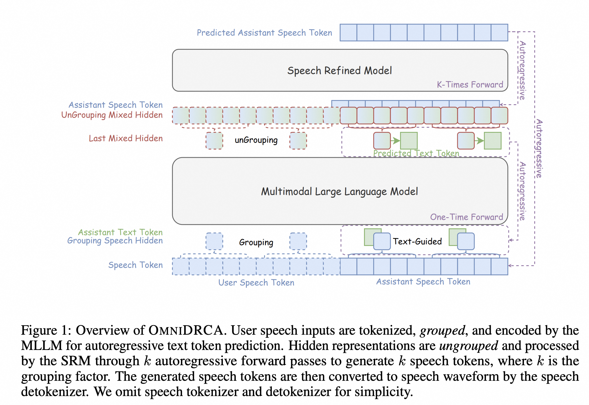
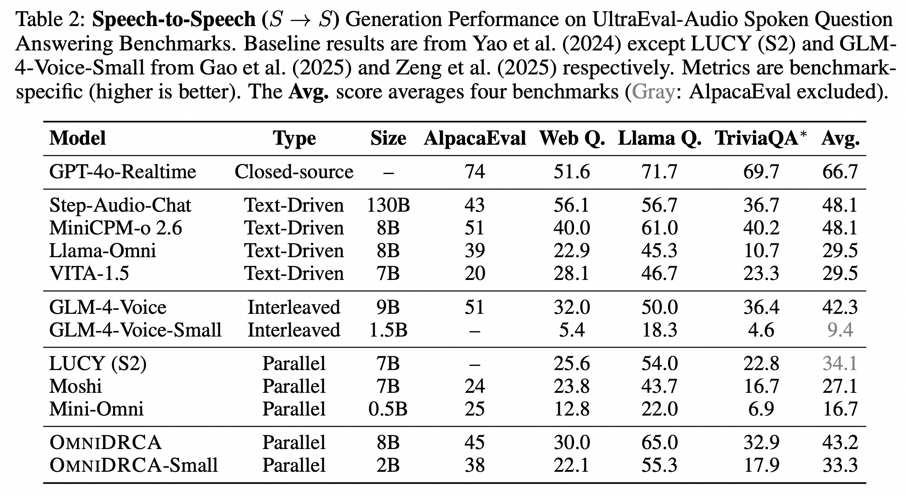
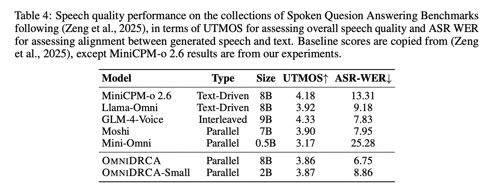

## Introduction

> This is a code repository for our paper ***[OmniDRCA: Parallel Speech-Text Foundation Model via Dual-Resolution Speech Representations and Contrastive Alignment](https://arxiv.org/abs/2506.09349)***. 

Recent studies on end-to-end speech generation with large language models (LLMs) have attracted significant community attention, with multiple works extending text-based LLMs to generate discrete speech tokens. Existing approaches primarily fall into two categories: (1) Methods that generate discrete speech tokens independently without incorporating them into the LLM's autoregressive process, resulting in text generation being unaware of concurrent speech synthesis. (2) Models that generate interleaved or parallel speech-text tokens through joint autoregressive modeling, enabling mutual modality awareness during generation. This paper presents OmniDRCA, a parallel speech-text foundation model based on joint autoregressive modeling, featuring dual-resolution speech representations and contrastive cross-modal alignment. Our approach processes speech and text representations in parallel while enhancing audio comprehension through contrastive alignment. Experimental results on Spoken Question Answering benchmarks demonstrate that OmniDRCA establishes new state-of-the-art (SOTA) performance among parallel joint speech-text modeling based foundation models, and achieves competitive performance compared to interleaved models. Additionally, we explore the potential of extending the framework to full-duplex conversational scenarios.

<div align=center></div>

<div align=center></div>

<div align=center></div>


## Changelog

- [x] [2025.06.13] Add a brief introduction to the paper in README.
- [] Release the source code
- [] Release the pretrained checkpoints

## Cite

```bibtex
@article{DBLP:journals/corr/abs-2410-17799,
  author       = {Chao-Hong Tan and
                  Qian Chen and
                  Wen Wang and
                  Chong Deng and
                  Qinglin Zhang,
                  Luyao Cheng and
                  Hai Yu and
                  Xin Zhang and
                  Xiang Lv and
                  Tianyu Zhao and
                  Chong Zhang and
                  Yukun Ma and
                  Yafeng Chen and
                  Hui Wang and
                  Jiaqing Liu and
                  Jieping Ye},
  title        = {OmniDRCA: Parallel Speech-Text Foundation Model via Dual-Resolution Speech Representations and Contrastive Alignment},
  journal      = {CoRR},
  volume       = {abs/2506.09349},
  year         = {2025},
  url          = {https://arxiv.org/abs/2506.09349},
  eprinttype    = {arXiv},
  eprint       = {2506.09349},
}
```

